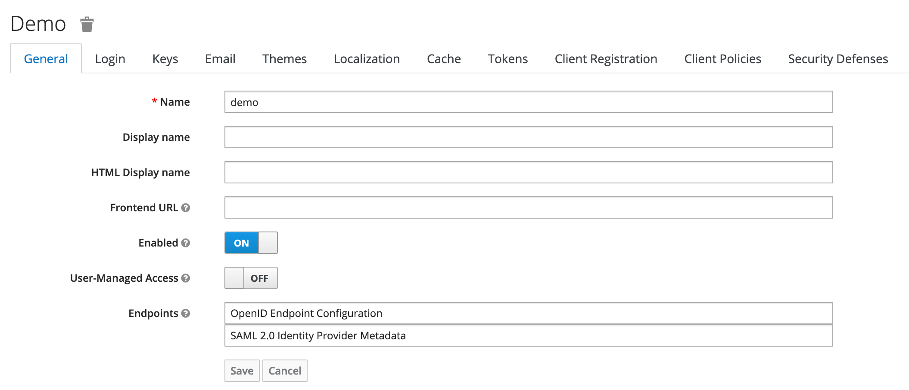
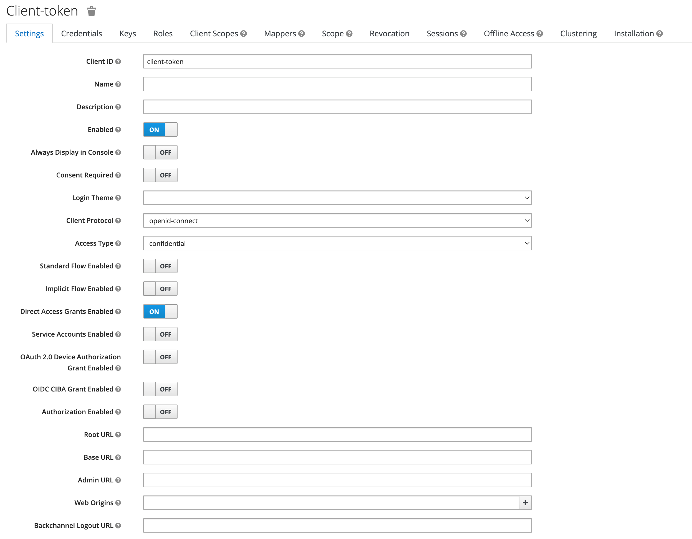
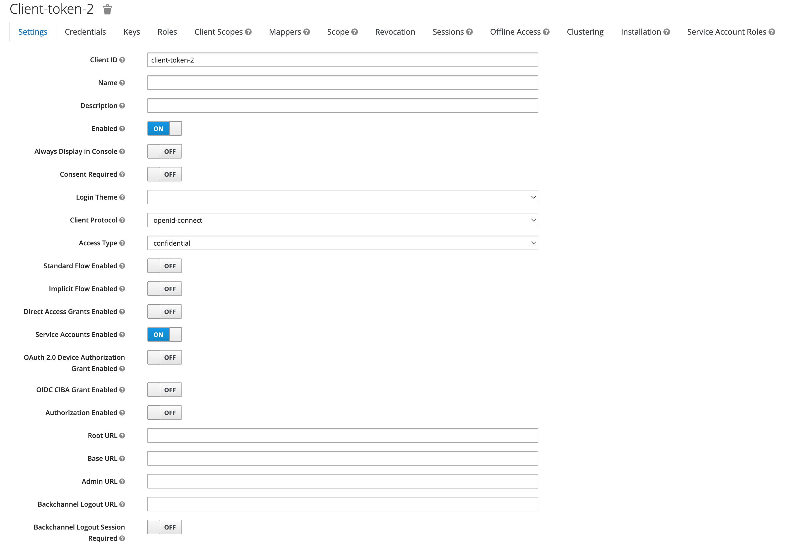
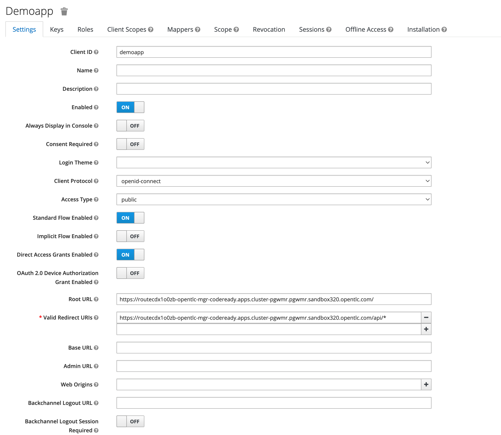
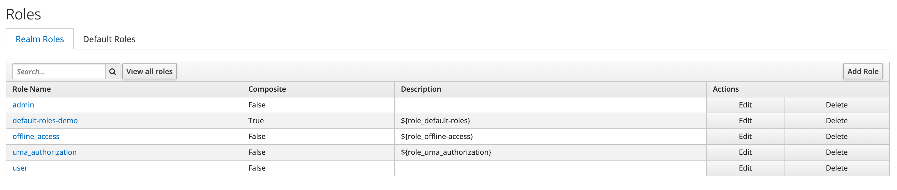
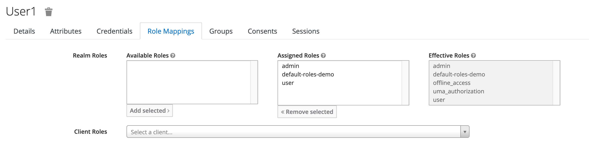

https://appdev.openshift.io/docs/spring-boot-runtime.html#mission-http-api-spring-boot

This is to show SSO page flow security using spring boot.    Follow the screens below to configure SSO.  Update the application.properties according to your environment. 

Based on 
* https://www.baeldung.com/spring-boot-keycloak
* https://www.yawintutor.com/there-was-an-unexpected-error-type-forbidden-status-403-access-denied/

Below are sample curls to generate JWT token with SSO.   Need to configure SSO with direct grant flow enabled.  

* 3 legged authentication 
curl --location --request POST 'https://keycloak-sso.apps.cluster-pgwmr.pgwmr.sandbox320.opentlc.com/auth/realms/demo/protocol/openid-connect/token' \
--header 'Content-Type: application/x-www-form-urlencoded' \
--data-urlencode 'client_id=client-token' \
--data-urlencode 'client_secret=caafe25a-491f-4021-b0b7-315b45e5c435' \
--data-urlencode 'grant_type=password' \
--data-urlencode 'scope=openid' \
--data-urlencode 'username=user1' \
--data-urlencode 'password=password'

* 2 legged authentication
curl --location --request POST 'https://keycloak-sso.apps.cluster-pgwmr.pgwmr.sandbox320.opentlc.com/auth/realms/demo/protocol/openid-connect/token' \
--header 'Content-Type: application/x-www-form-urlencoded' \
--data-urlencode 'client_id=client-token-2' \
--data-urlencode 'client_secret=8b7b069e-ecc2-4f92-8c7e-1c44acf73d33' \
--data-urlencode 'grant_type=client_credentials'

* To test the authentication for page flow above. 
curl --location --request POST 'https://keycloak-sso.apps.cluster-pgwmr.pgwmr.sandbox320.opentlc.com/auth/realms/demo/protocol/openid-connect/token' \
--header 'Content-Type: application/x-www-form-urlencoded' \
--data-urlencode 'client_id=demoapp' \
--data-urlencode 'username=user1' \
--data-urlencode 'password=password' \
--data-urlencode 'grant_type=password'

